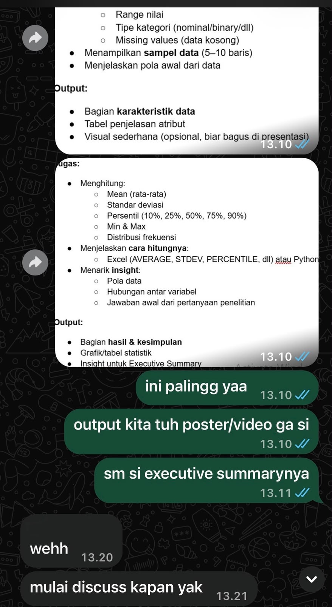
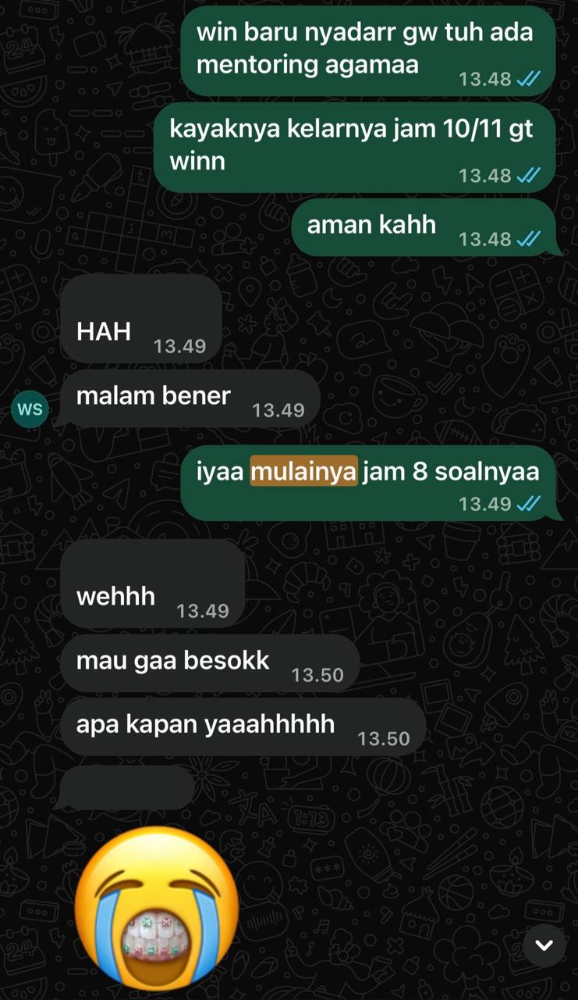

## Kompetensi target

Memisahkan event, fact, story, emotion, internal character, choice, dan action.

## Evidence wajib

- Satu episode komunikasi dengan diri sendiri.
- Initial story dan sedikitnya dua alternative narratives.
- Internal agreement dan bukti tindakan berikutnya.

::: {.callout-tip title="Lihat contoh pengisian"}
[Buka contoh fiktif Minggu 2](../examples/week-02.qmd) untuk melihat tingkat kekonkretan evidence dan analisis. Jangan menyalin contoh sebagai evidence pribadi.
:::

**Nama Mahasiswa     :** Rosianna Maria Aviv Silalahi  
**Tanggal Pengerjaan :** 27 September 2026

## Konteks performance

**Tanggal dan setting:** Antara Maret–Juni 2026, selama masa pengerjaan tugas besar saat beban tugas dari berbagai mata kuliah dan organisasi sedang menumpuk. Sebagian besar pengerjaan dilakukan di kost dan Student Lounge GKU 1 ITB Jatinangor, sementara momen pemicu utama (permintaan tambahan dari Rekan P) terjadi saat saya sedang beribadah di gereja.

**Persons dan relationship:** Dua rekan satu tim tugas besar, disamarkan sebagai Rekan P (anggota yang meminta tambahan pekerjaan menjelang tenggat) dan Rekan S (anggota yang beberapa kali lambat merespons koordinasi tim).

**Objective dan initial state:** State awal — saya memendam kekesalan dan mengerjakan seluruh bagian tersisa sendirian tanpa menyampaikan keberatan, sambil beberapa kali menangis karena beban yang dirasa timpang. Saya juga memegang beberapa objective sekaligus yang saling bertegangan yaitu menyelesaikan tugas tepat waktu, menjaga waktu ibadah dan istirahat pribadi saya, dan tetap menjaga hubungan baik dengan tim. Objective - Beralih dari reaksi otomatis (memendam) menuju respons yang disengaja yaitu menyelesaikan tanggung jawab sampai akhir sambil menjaga kejernihan batin, tanpa mengorbankan salah satu objective tersebut secara diam-diam.

## Episode yang dianalisis

> **Suara reaktif (Korban):** "Semua orang di tim ini egois, aku yang selalu kena getahnya. Tidak ada gunanya aku berbicara, lebih baik aku diam saja dan mengerjakan semuanya sendirian."  
> **Suara analitis:** "Coba dicek lagi, apa yang beneran kejadian? Rekan P minta tambahan pekerjaan saat aku sedang beribadah di gereja dan kontribusinya sendiri emang lebih sedikit dari yang dia minta ke aku. Rekan S emang beberapa kali lambat membalas pesan. Itu fakta. Tapi belum tentu mereka sengaja meremehkan aku. Mungkin saja Rekan P sedang panik sendiri soal kualitas tugas atau Rekan S ada kendala yang aku belum tahu."  
> **Suara pertumbuhan:** "Wajar lelah dan menangis, bebannya memang berat. Tapi aku udah buktiin aku bisa menyelesaikan tanggung jawab sampai akhir. Pelajarannya adalah aku perlu menyampaikan batas waktu aku lebih awal ke tim dan berani bilang langsung kalau pembagian tugas timpang."

Pergeseran dari suara reaktif ke suara analitis dan pertumbuhan ini mengubah pilihan saya dari sekadar bertahan diam menjadi merancang langkah konkret untuk proyek berikutnya yaitu menyampaikan jam-jam yang tidak bisa diganggu (termasuk waktu ibadah) sejak awal proyek dan menyampaikan keberatan secara asertif saat pembagian kerja terasa timpang, alih-alih memendamnya sendirian sampai menangis.

Ada ketidakpastian yang saya sadari sejak awal yaitu saya tidak pernah benar-benar tahu apakah Rekan P sengaja meremehkan waktu ibadah saya atau justru sedang panik sendiri menghadapi tenggat sehingga tidak sadar waktu saat mengirim pesan. Begitu juga saya tidak tahu pasti alasan Rekan S lambat merespons. Saya juga menyadari saya tidak punya otoritas formal untuk memaksa keduanya mengubah perilaku mereka. Hal yang bisa saya kendalikan hanya cara saya merespons dan menyampaikan batas saya sendiri. Trade-off yang saya ambil saat itu adalah mengorbankan waktu istirahat pribadi demi menyelesaikan tugas tepat waktu dengan risiko yang saya terima sadar karena dampak keterlambatan ke nilai kelompok dianggap lebih besar daripada risiko kelelahan pribadi saat itu. Namun saya juga sadar pola ini tidak bisa terus-menerus diulang sehingga saya merumuskan rencana perbaikan (repair) untuk proyek berikutnya alih-alih membiarkan pola yang sama terjadi lagi.

## Evidence

::: {.evidence-block}
Karena episode ini bersifat proses batin (intra-self communication), tidak ada artefak eksternal seperti chat, commit, atau screenshot yang relevan untuk dilampirkan sehingga bukti utamanya adalah proses berpikir itu sendiri yang saya dokumentasikan secara tertulis dalam bentuk jurnal reflektif segera setelah kejadian.

**Dokumen lengkap:** [Lembar Kerja Bab 02 — Tiga Narasi atas Satu Peristiwa](../lk/lk-02.qmd), berisi pemisahan fakta objektif, interpretasi pertama, emosi dan sensasi tubuh, serta tiga narasi lengkap (Korban, Analitis, Pertumbuhan) atas peristiwa yang sama.

**Cuplikan proses berpikir yang terekam:**

> Fakta: "Rekan P mengirim permintaan tambahan saat saya sedang berada di gereja. Kontribusi Rekan P pada bagiannya sendiri lebih sedikit dari yang ia minta dari saya."
>
> Interpretasi pertama: "Rekan P tidak peduli saya sedang ibadah atau tidak. Ia egois dan tidak menghargai waktu saya sama sekali."
>
> Pergeseran ke narasi analitis: "Bisa saja Rekan P lagi panik sendiri soal kualitas tugas. Belum tentu mereka sengaja meremehkan saya."

**Kontribusi pribadi:** Seluruh isi substantif berasal dari pengalaman saya sendiri. Fakta yang benar-benar terjadi, interpretasi pertama yang muncul di kepala saya, emosi dan sensasi tubuh yang saya rasakan, hingga pelajaran dan rencana tindakan yang saya pilih untuk ke depannya. Proses pengorganisasian cerita mentah tersebut ke dalam struktur fakta/interpretasi/tiga narasi sesuai format lembar kerja dibantu oleh AI, namun keputusan mana yang menjadi fakta, mana yang sekadar asumsi, serta narasi dan tindakan mana yang saya pilih untuk dipegang, sepenuhnya merupakan penilaian saya sendiri.

**Bukti realisasi rencana (tambahan pasca-revisi):**

{width="50%"}

{width="50%"}

Screenshot kedua menunjukkan realisasi nyata dari rencana "next practice" pada episode sebelumnya: saya secara proaktif menyampaikan batas waktu pribadi (jadwal mentoring agama) ke grup proyek Literasi Data dan Inteligensi Artifisial pada 4 Mei 2026, alih-alih memendamnya seperti pola lama. Kelompok merespons dengan menyesuaikan jadwal diskusi ke keesokan harinya.

:::

## Analisis komunikasi

| Elemen | Evidence dan analisis |
|---|---|
| Person & character | Suara batin "Korban" awalnya menilai Rekan P dan Rekan S lewat stereotype "egois" dan "sengaja menghindar". Setelah dianalisis, saya membaca ulang context dan power di baliknya yaitu Rekan P mungkin bertindak dari kecemasannya sendiri soal kualitas tugas (bukan otoritas untuk menuntut) dan saya sendiri sebenarnya juga tidak punya otoritas formal untuk menolak permintaannya begitu saja. Pemetaan ulang ini menggantikan stereotype awal dengan pembacaan power dan context yang lebih jernih. |
| Objective & state | Saya mengelola tiga objective sekaligus yang saling bertegangan (menyelesaikan tugas, menjaga waktu ibadah/istirahat, menjaga hubungan tim), plus uncertainty soal niat sebenarnya di balik perilaku Rekan P dan Rekan S yang tidak pernah benar-benar terverifikasi. |
| Repertoire & language | Repertoire bergeser dari diam dan memendam menjadi menyusun rencana komunikasi asertif ("aku bisa bantu bagian ini, tapi kontribusi kita perlu lebih seimbang..."); AI digunakan secara proporsional untuk merapikan struktur dengan batas dan rationale yang jelas. |
| Response & adaptation | Sensasi tubuh (dada berat dan rahang mengencang) menjadi sinyal lemah yang saya baca sebagai tanda sedang terjebak di narasi Korban. Alih-alih mengabaikannya, saya menggunakan sinyal itu untuk menghentikan loop reaktif (diam-memendam) dan menggantinya dengan loop baru yaitu mengenali sinyal tubuh → mengecek fakta vs asumsi → memilih respons yang saya rencanakan untuk terus dipakai di proyek-proyek berikutnya. |
| Agreement/action | Kesepakatan dengan diri sendiri eksplisit dan mempertimbangkan trade-off (waktu pribadi vs tenggat tim) serta batas otoritas saya (tidak berwenang mengubah perilaku Rekan P/Rekan S, hanya bisa mengelola respons dan batas saya sendiri), dilengkapi rencana repair konkret untuk proyek berikutnya: menyampaikan batas waktu di awal dan bersuara langsung saat pembagian kerja timpang. |
| Relationship outcome | Dengan tidak langsung menuduh Rekan P dan Rekan S secara sepihak, ruang untuk hubungan kerja yang tetap sehat ke depannya terjaga, sekaligus kebutuhan saya sendiri soal batas waktu dan keadilan pembagian kerja tidak lagi dipendam sendirian. |

## Penggunaan AI

- **Alat dan peran AI:** Claude digunakan sebagai reflection mirror untuk membantu memisahkan fakta dari cerita/asumsi pada pengalaman yang saya ceritakan dan merapikan struktur tiga narasi (Korban, Analitis, Pertumbuhan) dan rencana respons.
- **Prompt/instruksi penting:** Saya menceritakan kejadian nyata secara mentah (masih bercampur emosi dan asumsi) lalu meminta bantuan memilah menjadi fakta objektif, interpretasi pertama, emosi, dan tiga versi narasi sesuai kerangka lembar kerja Bab 02.
- **Bagian yang digunakan/diubah/ditolak:** Struktur kalimat dan pemilahan fakta-vs-interpretasi dari AI saya gunakan, tetapi seluruh isi faktual (waktu kejadian, siapa yang terlibat, apa yang benar-benar diminta/dikatakan, emosi yang dirasakan) berasal dari pengalaman saya sendiri. Saya sengaja membatasi peran AI hanya pada penyusunan struktur dan pemilahan bahasa, bukan pada penentuan narasi mana yang "benar" atau keputusan tindakan akhir, karena penilaian itu hanya bisa saya ambil sendiri.
- **Pemeriksaan accuracy, privacy, authority:** Nama rekan tim disamarkan menjadi "Rekan P" dan "Rekan S" demi privasi, detail kejadian saya periksa ulang kesesuaiannya dengan yang benar-benar terjadi sebelum dimasukkan ke evidence.
- **Yang tetap saya pelajari sebagai manusia:** Menyadari bahwa emosi yang saya rasakan valid, tetapi keputusan narasi mana yang mau saya pegang dan tindakan apa yang mau saya ambil ke depan tetap harus saya putuskan sendiri berdasarkan nilai dan situasi nyata saya — termasuk menimbang trade-off dan batas otoritas saya sendiri yang tidak bisa digantikan AI karena butuh kejujuran menilai posisi saya sendiri dalam relasi tim.

## Feedback dan tindak lanjut

**Feedback yang diterima:** Menurut orang tua saya, saya perlu lebih berani dan lebih tegas dalam menghadapi situasi seperti ini ke depannya. - Orang tua

**Adaptation/replay:** Setelah menyelesaikan tugas besar, saya menyadari bahwa memendam kekesalan sampai menangis bukan strategi yang berkelanjutan, ke depannya saya berencana menyampaikan batas dan keberatan lebih awal alih-alih menahannya sampai akhir pengerjaan.

**Next practice (sudah direalisasikan):** Pada 4 Mei 2026, dalam proyek kelompok mata kuliah Literasi Data dan Inteligensi Artifisial, saya proaktif menyampaikan ke grup bahwa saya ada mentoring agama yang baru selesai sekitar jam 10-11 malam, dan menanyakan apakah itu masih memungkinkan untuk jadwal diskusi kelompok malam itu ("win baru nyadar gw tuh ada mentoring agama... kayaknya kelarnya jam 10/11 gt winn, aman kahh"). Rekan kelompok (WS) awalnya kaget ("HAH malam bener"), namun setelah saya konfirmasi ulang bahwa diskusi rencananya mulai jam 8 malam, kelompok akhirnya sepakat menjadwalkan ulang diskusi ke keesokan harinya. Ini merupakan eksekusi nyata dari rencana "menyampaikan jam-jam yang tidak bisa diganggu sejak awal proyek" yang saya rumuskan di episode sebelumnya dan bukan lagi sekadar niat, melainkan tindakan yang benar-benar saya lakukan dan direspons oleh tim.

## Self-assessment

| Dimensi | Skor 1–4 | Evidence singkat |
|---|---:|---|
| Person & Character | 4 | Person, character, dan power/context dibaca ulang: stereotype awal ("egois") digantikan pembacaan bahwa Rekan P mungkin bertindak dari kecemasannya sendiri, bukan otoritas formal |
| Objective & State | 4 | Mengelola tiga objective sekaligus (tugas, batas pribadi, relasi tim) beserta uncertainty soal niat sebenarnya di balik perilaku rekan yang tidak pernah terverifikasi |
| Repertoire, Language & AI | 4 | Repertoire beradaptasi luwes (dari diam menjadi rencana asertif) dengan batas dan rationale AI yang jelas |
| Response & Adaptation | 4 | Sinyal lemah (sensasi tubuh) terbaca dan dipakai untuk memutus loop reaktif dan digantikan loop baru sinyal→cek fakta→pilih respons |
| Agreement, Action & Relationship | 4 | Trade-off (waktu pribadi vs tenggat), batas otoritas, dan rencana repair untuk proyek berikutnya dikelola secara eksplisit dan realisasi nyata sudah dilakukan pada 4 Mei 2026 (lihat evidence tambahan) |

**Total: 20/20 — Lanjut.** Seluruh dimensi menunjukkan analisis yang melampaui deskripsi dasar: power/otoritas, uncertainty, trade-off, dan sinyal lemah semuanya dibaca dan direspons secara sadar dalam satu episode.

::: {.assessor-only}
### Assessment dosen

**Skor:** — / 20  
**Evidence yang mendukung:** —  
**Prioritas perbaikan:** —  
**Keputusan:** Belum dinilai / Perlu revisi / Tercapai
:::