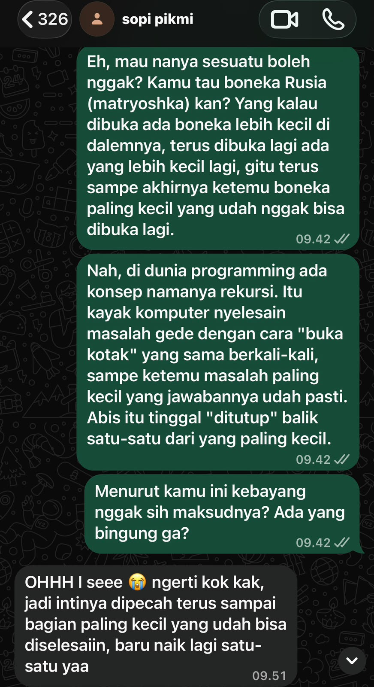

## Kompetensi target

Mengadaptasi repertoire dan language tanpa mengubah core meaning.

## Evidence wajib

- Lima versi untuk friend, technical peer, manager, customer, dan public.
- Alasan perubahan language dan repertoire.
- Feedback understanding dari sedikitnya satu target.

::: {.callout-tip title="Lihat contoh pengisian"}
[Buka contoh fiktif Minggu 4](../examples/week-04.qmd) untuk melihat tingkat kekonkretan evidence dan analisis. Jangan menyalin contoh sebagai evidence pribadi.
:::

**Nama Mahasiswa     :** Rosianna Maria Aviv Silalahi  
**Tanggal Pengerjaan :** 27 September 2026

## Konteks performance

**Tanggal dan setting:** 27 September 2026. Proses dekonstruksi jargon dan penyusunan kelima versi terjemahan dikerjakan sendiri, kemudian salah satu versi diuji langsung lewat chat WhatsApp ke adik saya.

**Persons dan relationship:** Adik saya, sebagai target uji untuk ragam bahasa "Anak-Anak", karena ia tidak memiliki latar belakang ilmu komputer dan cocok mewakili audiens awam.

**Objective dan initial state:** State awal — saya memiliki definisi teknis konsep rekursi yang penuh jargon (*base case*, *call stack*, *stack overflow*) yang hanya bisa dipahami sesama mahasiswa Informatika/STI. Saya memegang dua objective yang saling bertegangan yaitu menjaga kebenaran inti tetap utuh (*fidelity*) sekaligus membuatnya cukup sederhana untuk dipahami audiens yang sama sekali tidak punya latar belakang teknis. Dua tujuan yang mudah saling mengorbankan satu sama lain kalau tidak dikelola sadar. Objective — meruntuhkan jargon menjadi satu kebenaran inti, menerjemahkannya ke lima ragam bahasa tanpa mengubah esensinya, dan memverifikasi pemahaman pada target nyata tanpa tahu pasti apakah elemen yang paling sulit (proses "kembali" dari rekursi) akan ikut tertangkap atau tidak.

## Episode yang dianalisis

Konsep yang saya pilih adalah **rekursi**. Kebenaran inti yang saya rumuskan: "cara menyelesaikan masalah besar dengan memecahnya menjadi masalah yang lebih kecil namun bentuknya sama, diulang terus-menerus, sampai ketemu masalah paling sederhana yang bisa langsung dijawab." Dari kebenaran inti ini, saya menyusun lima versi bahasa (detail lengkap ada di evidence), lalu memilih versi "Anak-Anak" (analogi boneka Rusia/matryoshka) untuk diuji ke adik saya lewat chat. Hal ini bukan versi yang paling mudah bagi saya untuk menulisnya, melainkan versi yang risiko distorsinya paling tinggi karena audiensnya paling jauh dari latar belakang teknis saya.

> **Saya:** "Eh, mau nanya sesuatu boleh nggak? Kamu tau boneka Rusia (matryoshka) kan?... Nah, di dunia programming ada konsep namanya rekursi. Itu kayak komputer nyelesain masalah gede dengan cara 'buka kotak' yang sama berkali-kali sampai ketemu masalah paling kecil yang jawabannya udah pasti. Setelah itu tinggal 'ditutup' balik satu-satu dari yang paling kecil."  
> **Adik saya:** "OHHH I see 😭 ngerti kok kak, jadi intinya dipecah terus sampai bagian paling kecil yang udah bisa diselesaiin, baru naik lagi satu-satu yaa"

Sebelum membaca balasannya, saya sempat tidak yakin apakah adik saya akan menangkap elemen "naik kembali satu-satu" (representasi dari *call stack* yang di-*pop*). Dalam pengalaman saya, ini bagian yang paling sering hilang saat rekursi dijelaskan ke orang awam, karena penjelas cenderung berhenti di "dipecah jadi kecil" saja. Emoji "😭" di balasannya juga sempat menjadi sinyal ambigu bagi saya: apakah itu tanda kewalahan/bingung, atau justru tanda "aha moment"? Saya tidak langsung menyimpulkan analogi ini berhasil hanya dari kata "ngerti kok kak". Saya membaca lanjutan kalimatnya untuk memastikan pemahaman itu genuine, bukan sekadar respons sopan. Ternyata ia berhasil merangkum ulang dengan kata-katanya sendiri, termasuk elemen tersulit itu sehingga saya menyimpulkan trade-off yang saya ambil (menyederhanakan lewat analogi fisik dengan risiko mengurangi presisi teknis) berhasil tanpa mengorbankan kebenaran inti.

## Evidence

::: {.evidence-block}
**Dokumen lengkap:** [Lembar Kerja Bab 04 — Portofolio Terjemahan Lima Bahasa](../lk/lk-04.qmd), berisi dekonstruksi jargon lengkap dan kelima versi terjemahan (anak-anak, sahabat, rekan teknis, manajer, publik) atas konsep rekursi.

**Bukti feedback understanding:** 

{width="50%"}

Screenshot di atas menunjukkan pemahaman yang tepat terhadap versi "Anak-Anak" termasuk elemen tersulit (proses "kembali") tanpa perlu klarifikasi tambahan dari saya.

**Kontribusi pribadi:** Seluruh proses detoks jargon, perumusan kebenaran inti, dan penyusunan kelima versi terjemahan merupakan hasil kerja saya sendiri berdasarkan pemahaman saya atas konsep rekursi dari mata kuliah Algoritma dan Pemrograman. AI digunakan sebatas pengecek konsistensi kebenaran inti antar-versi setelah kelima draf selesai saya susun (lihat bagian Penggunaan AI); pemilihan analogi, keputusan trade-off antara fidelity dan kemudahan pemahaman, serta interpretasi terhadap respons asli adik saya sepenuhnya saya lakukan dan pertanggungjawabkan sendiri.
:::

## Analisis komunikasi

| Elemen | Evidence dan analisis |
|---|---|
| Person & character | Saya menyesuaikan diri dari "mahasiswa yang menjelaskan lewat jargon teknis" menjadi "kakak yang bercerita lewat analogi" sekaligus membaca power dinamis dalam relasi itu. Sebagai kakak, saya punya kecenderungan untuk buru-buru "mengoreksi" jika ada yang kurang tepat, namun saya sengaja menahan diri dan membiarkan adik saya menyelesaikan kalimatnya sendiri dulu sebelum menilai pemahamannya. |
| Objective & state | Saya mengelola dua objective yang saling bertegangan (fidelity vs kemudahan pemahaman) sekaligus uncertainty soal apakah elemen tersulit (proses kembali/*call stack*) akan tertangkap atau hilang dalam proses penyederhanaan. |
| Repertoire & language | Repertoire bergeser dari istilah teknis (*base case*, *call stack*) menjadi analogi konkret (boneka Rusia) yang akrab dengan dunia anak-anak dengan AI digunakan secara proporsional dan berbatas jelas (lihat bagian Penggunaan AI). |
| Response & adaptation | Respons "ngerti kok kak... 😭" awalnya ambigu (bisa berarti kewalahan atau paham), namun saya membaca sinyal itu lebih dalam lewat kalimat lanjutannya sebelum menyimpulkan analogi berhasil dan bukan menerima respons permukaan begitu saja. |
| Agreement/action | Trade-off antara presisi teknis dan kesederhanaan dikelola secara sadar. Saya memilih mengorbankan sedikit presisi (analogi fisik, bukan istilah call stack) dengan risiko yang saya terima karena tujuan utamanya adalah pemahaman audiens awam, bukan akurasi teknis untuk audiens ini. Saya juga tidak melampaui otoritas saya sebagai "penjelas informal" dengan memaksakan istilah teknis yang tidak relevan bagi adik saya. |
| Relationship outcome | Percakapan berlangsung santai dan adik saya tidak merasa digurui atau bingung sehingga ruang untuk bertanya hal lain ke saya soal kuliah/topik teknis lain tetap terbuka ke depannya. |

## Penggunaan AI

- **Alat dan peran AI:** Claude digunakan sebagai pengecek konsistensi (*consistency checker*) untuk memastikan kelima versi terjemahan yang sudah saya susun sendiri tetap menjaga kebenaran inti (base case, pengulangan menuju masalah lebih kecil) tanpa ada yang terdistorsi serta membantu merumuskan draf pesan yang saya kirim ke adik saya untuk pengujian pemahaman.
- **Prompt/instruksi penting:** Setelah menyusun kelima versi terjemahan sendiri, saya meminta Claude mengecek apakah kelima versi tersebut tetap konsisten menjaga kebenaran inti tanpa ada yang terdistorsi.
- **Bagian yang digunakan/diubah/ditolak:** Kelima versi terjemahan (analogi, pilihan kata, struktur penjelasan) murni saya susun sendiri berdasarkan pemahaman saya dari mata kuliah Algoritma dan Pemrograman. Umpan balik dari AI soal versi manajer (perlu menekankan risiko *stack overflow*, bukan hanya manfaat) saya terima dan terapkan karena masuk akal dan memperkuat keseimbangan framing-nya. Saya sengaja tidak meminta AI untuk menafsirkan respons asli adik saya karena menilai apakah emoji dan kalimatnya menunjukkan pemahaman genuine atau sekadar respons sopan adalah penilaian yang harus saya lakukan sendiri berdasarkan kedekatan saya dengannya.
- **Pemeriksaan accuracy, privacy, authority:** Saya memeriksa ulang definisi teknis rekursi (base case, call stack, stack overflow) agar sesuai dengan materi kuliah yang sudah saya pelajari, bukan sekadar mengikuti definisi dari AI mentah-mentah.
- **Yang tetap saya pelajari sebagai manusia:** Menyadari bahwa memahami suatu konsep secara teknis tidak otomatis membuat saya bisa menjelaskannya dengan baik. Kemampuan menyusun analogi sendiri, membaca sinyal ambigu dari respons audiens asli, dan menimbang trade-off antara presisi dan kesederhanaan adalah penilaian yang harus saya lakukan sendiri, tidak bisa digantikan AI.

## Feedback dan tindak lanjut

**Feedback yang diterima:** Adik saya menjawab "ngerti kok kak, jadi intinya dipecah terus sampai bagian paling kecil yang udah bisa diselesaiin, baru naik lagi satu-satu yaa" yang menunjukkan pemahaman yang tepat terhadap kebenaran inti konsep rekursi, termasuk elemen "naik kembali" yang paling sering hilang saat konsep ini disederhanakan untuk audiens awam.

**Adaptation/replay:** Karena versi "Anak-Anak" terbukti berhasil dipahami secara utuh (termasuk elemen tersulitnya) tanpa klarifikasi tambahan, saya menyadari bahwa analogi yang melibatkan objek fisik berlapis (seperti boneka Rusia) efektif untuk menjaga fidelity sekaligus kesederhanaan pada konsep yang bersifat berulang dan bertingkat. Sebuah pola trade-off yang bisa saya pakai lagi untuk konsep-konsep serupa ke depannya.

**Next practice:** Menguji keempat versi lainnya (sahabat, rekan teknis, manajer, publik) ke target yang sesuai, terutama versi manajer yang saya rasa paling sulit saya susun, untuk memastikan pola trade-off yang sama juga berhasil di ragam bahasa yang berbeda.

## Self-assessment

| Dimensi | Skor 1–4 | Evidence singkat |
|---|---:|---|
| Person & Character | 4 | Penyesuaian diri dari "penjelas teknis" ke "kakak yang bercerita" dilakukan sadar, termasuk membaca power dinamis dalam relasi kakak-adik dan menahan diri dari kecenderungan buru-buru mengoreksi |
| Objective & State | 4 | Mengelola dua objective yang saling bertegangan (fidelity vs kesederhanaan) sekaligus uncertainty soal elemen tersulit yang belum tentu tertangkap |
| Repertoire, Language & AI | 4 | Repertoire beradaptasi luwes ke lima ragam berbeda, dengan batas dan rationale AI yang jelas |
| Response & Adaptation | 4 | Sinyal ambigu (emoji, respons singkat) tidak diterima mentah-mentah, melainkan dibaca lebih dalam lewat kalimat lanjutan sebelum disimpulkan sebagai keberhasilan |
| Agreement, Action & Relationship | 4 | Trade-off presisi vs kesederhanaan dan batas otoritas sebagai "penjelas informal" dikelola eksplisit, dengan rencana review lanjutan ke empat versi lain |

**Total: 20/20 — Lanjut.** Seluruh dimensi menunjukkan analisis yang melampaui deskripsi dasar: trade-off, uncertainty, power dinamis, dan sinyal ambigu semuanya dibaca dan direspons secara sadar dalam satu episode pengujian.

::: {.assessor-only}
### Assessment dosen

**Skor:** — / 20  
**Evidence yang mendukung:** —  
**Prioritas perbaikan:** —  
**Keputusan:** Belum dinilai / Perlu revisi / Tercapai
:::