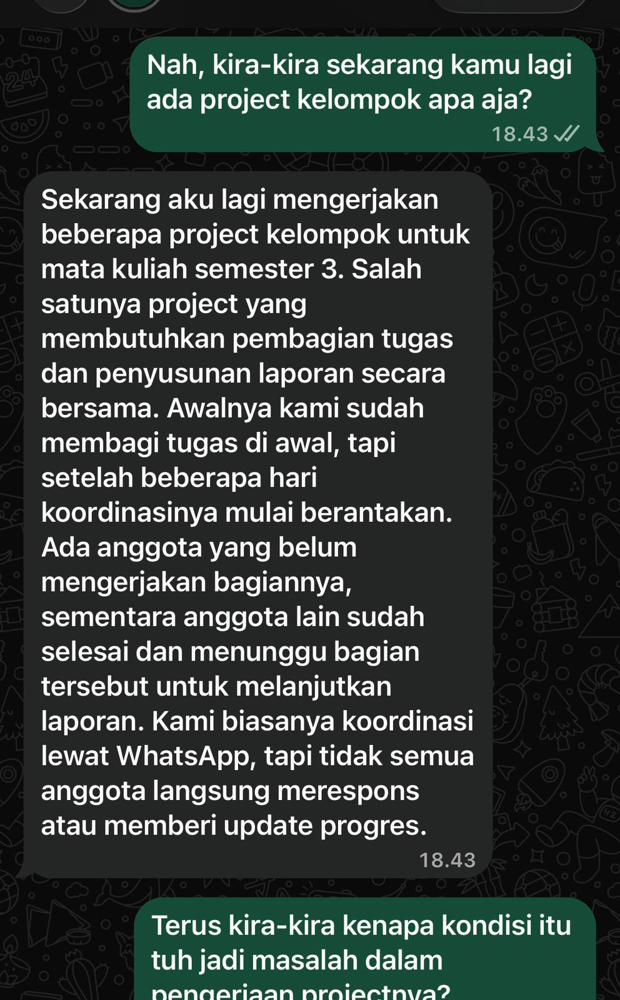
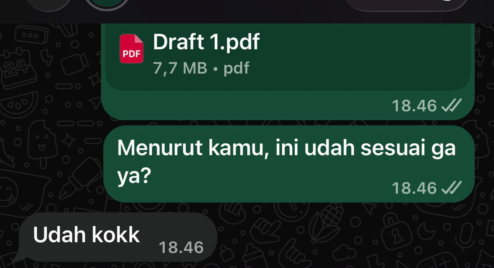

## Kompetensi target

Mendengar sebelum proposing dan membangun shared problem statement dengan person.

## Evidence wajib

- Initial assumption dan pertanyaan discovery.
- Transcript/paraphrase serta problem impact dan constraint.
- Shared problem statement yang dikonfirmasi partner.

::: {.callout-tip title="Lihat contoh pengisian"}
[Buka contoh fiktif Minggu 5](../examples/week-05.qmd) untuk melihat tingkat kekonkretan evidence dan analisis. Jangan menyalin contoh sebagai evidence pribadi.
:::

## Konteks performance

**Tanggal dan setting:** 27 September 2026, percakapan jarak jauh (chat WhatsApp) antara Bandung dan Surabaya.

**Persons dan relationship:** Narasumber disamarkan sebagai Mitra K, mahasiswa Teknik Industri ITS semester 3, berelasi sebagai sesama mahasiswa/teman.

**Objective dan initial state:** State awal — saya berasumsi masalah kerja kelompok Mitra K soal kurangnya tools/aplikasi manajemen tugas. Objective — menguji asumsi tersebut lewat 5 Pertanyaan Penemuan dan merumuskan shared problem statement yang dikonfirmasi Mitra K, tanpa menyebut solusi teknis.

## Evidence

::: {.evidence-block}
**Log wawancara (5 Pertanyaan Penemuan):**

1. **Kejadian nyata:** "Sekarang aku lagi mengerjakan beberapa project kelompok untuk mata kuliah semester 3... Awalnya kami sudah membagi tugas di awal, tapi setelah beberapa hari koordinasinya mulai berantakan. Ada anggota yang belum mengerjakan bagiannya... Kami biasanya koordinasi lewat WhatsApp, tapi tidak semua anggota langsung merespons."
2. **Dampak:** "Kalau satu bagian terlambat, bagian lain yang bergantung pada bagian tersebut juga ikut tertunda. Aku jadi harus mengingatkan anggota beberapa kali... waktu yang seharusnya bisa dipakai untuk mengecek kualitas laporan malah habis untuk mengejar progres anggota."
3. **Pihak terdampak:** "Seluruh anggota kelompok... Aku sendiri jadi lebih kepikiran... Dosen juga bisa menerima hasil yang kurang maksimal."
4. **Keadaan lebih baik:** "Setiap anggota tahu tugasnya dengan jelas, tahu deadline masing-masing, dan rutin memberikan update... masih punya waktu untuk mengecek dan memperbaiki laporan."
5. **Kendala:** "Jadwal masing-masing anggota berbeda... kami masih belajar membagi pekerjaan dengan baik... waktu yang terbatas menjelang deadline."

Seluruh isi log ini murni transkrip jawaban Mitra K, kontribusi saya adalah pertanyaan pemandu dan penyusunan ke format terstruktur.

**Cuplikan wawancara (WhatsApp):**

{width="50%"}

**Konfirmasi Draft 1:**

{width="50%"}
:::

## Person/character map

Mitra K bukan pemimpin formal kelompoknya, tapi dari cerita "aku sendiri jadi lebih kepikiran... aku jadi harus mengingatkan anggota" terlihat perubahan peran informal — ia mengambil peran **de facto koordinator/quality controller** meski tidak ditunjuk secara resmi. Konteks ini penting karena memengaruhi jenis dukungan yang relevan untuk Mitra K: bukan hanya "cara agar tim lebih rajin", tapi juga bagaimana Mitra K sendiri bisa melepas beban informal itu tanpa kehilangan kendali kualitas laporan.

## Analisis komunikasi

| Elemen | Evidence dan analisis |
|---|---|
| Person & character | Mitra K dipetakan bukan sekadar "anggota kelompok", tapi anggota yang perannya bergeser jadi koordinator informal tanpa otoritas resmi. Perubahan role dan power ini yang membuat bebannya terasa lebih berat dibanding anggota lain. |
| Objective & state | Ada dua kemungkinan penyebab yang perlu dikelola sebagai uncertainty: (1) masalah sistemik jadwal yang genuinely bentrok atau (2) sebagian anggota kurang berkomitmen. Saya tidak langsung menyimpulkan salah satu. Problem statement akhir sengaja dirumuskan agar tetap valid untuk kedua kemungkinan itu ("kejelasan pembagian tugas dan kebiasaan update" bukan menuduh siapa pun "malas"). |
| Repertoire & language | Sengaja tidak memakai AI secara real-time saat wawancara berlangsung (percakapan murni manusia-ke-manusia lewat chat), dengan rationale yaitu penggunaan AI saat itu berisiko membuat respons saya terasa kaku/template dan mengganggu keakraban sebagai teman. AI baru dipakai setelah wawancara selesai, khusus untuk merapikan struktur dan boundary ini saya tetapkan sendiri sebelum memulai. |
| Response & adaptation | Saya menangkap **sinyal lemah** di jawaban Pertanyaan 3 yaitu kalimat "aku sendiri jadi lebih kepikiran" diucapkan Mitra K meski pertanyaan saya cuma soal "siapa yang kena dampak" dan bukan soal perasaannya. Saya tidak mengabaikan sinyal ini dan saya membawanya ke person/character map di atas, alih-alih hanya mencatatnya sebagai satu poin dampak biasa. |
| Agreement/action | Ada trade-off yang saya sadari yaitu menawarkan diri membantu Mitra K (misal ikut menyusun template pembagian tugas) berisiko membuat saya mengambil alih otoritas yang bukan milik saya di kelompok itu (saya bukan anggota timnya). Karena itu saya membatasi tindak lanjut pada dukungan sebagai teman (follow-up personal), bukan ikut campur langsung ke keputusan internal timnya dan menghormati batas otoritas yang bukan milik saya. |
| Relationship outcome | Mitra K merasa didengar tanpa buru-buru diberi solusi. Relasi tetap terjaga sebagai teman yang saling percaya cerita masalah nyata dengan rencana review lanjutan yang jelas. |

**Shared problem statement yang dikonfirmasi Mitra K:**

> Mitra K, mahasiswa Teknik Industri ITS semester 3 yang menjadi anggota kelompok project, mengalami keterlambatan penyelesaian tugas dari sebagian anggota tanpa update progres yang jelas ketika mengerjakan laporan kelompok mendekati deadline melalui koordinasi WhatsApp sehingga bagian pekerjaan yang saling bergantung ikut tertunda dan waktu untuk mengecek kualitas laporan berkurang karena ia harus mengingatkan dan merapikan bagian anggota lain. Ia membutuhkan kejelasan pembagian tugas beserta deadline masing-masing anggota dan kebiasaan memberi update progres secara rutin dengan mempertimbangkan perbedaan jadwal kuliah/kegiatan tiap anggota dan keterbatasan waktu menjelang deadline.

## Penggunaan AI

- **Alat dan peran AI:** Claude digunakan **setelah** wawancara selesai (bukan real-time) untuk merapikan log mentah menjadi format terstruktur dan menyusun kalimat shared problem statement memakai formula standar dari buku ajar berdasarkan fakta di log.
- **Prompt/instruksi penting:** diminta menyusun log wawancara dan merumuskan pernyataan masalah tanpa menyebut solusi teknis berdasarkan jawaban asli Mitra K.
- **Bagian yang digunakan/diubah/ditolak:** isi jawaban wawancara sepenuhnya dari transkrip asli dan tidak diubah AI. Kalimat formula pernyataan masalah disusun AI berdasarkan fakta kemudian saya baca ulang untuk memastikan tidak ada penyebutan solusi teknis yang tersisip.
- **Pemeriksaan accuracy, privacy, authority:** nama asli Mitra K disamarkan menjadi inisial di seluruh dokumen; isi pernyataan masalah diperiksa tidak menyebut solusi teknis apa pun.
- **Yang tetap saya pelajari sebagai manusia:** menahan asumsi awal (soal tools), menangkap sinyal emosional yang tidak ditanyakan secara eksplisit ("aku jadi lebih kepikiran"), dan menimbang batas otoritas saya sebagai orang luar tim — ini murni dari kepekaan saya sendiri, bukan dari AI.

## Refleksi Intrapribadi

> Saya cukup cepat menahan diri untuk tidak langsung menawarkan solusi di awal karena sejak awal sudah berniat mendengarkan dulu sebelum menyimpulkan apa pun. Meski di kepala sempat muncul dugaan "mungkin dia butuh tools manajemen tugas". Asumsi itu ternyata keliru: setelah mendengarkan cerita Mitra K secara utuh lewat lima pertanyaan penemuan, masalah sebenarnya bukan soal alat komunikasi (mereka sudah pakai WhatsApp), melainkan soal kejelasan pembagian tugas dan kebiasaan memberi update progres. Saya juga menyadari saya cenderung ingin cepat menyimpulkan solusi karena terbiasa berpikir efisien, jadi latihan menahan diri dan mengonfirmasi ulang pemahaman saya ke Mitra K ini terasa berguna. Sebagai langkah kecil menjaga kepercayaan profesional dengannya, saya berkomitmen mengirimkan Pernyataan Masalah final ini kepada Mitra K sebagai bentuk transparansi, dan menanyakan kabar timnya sekali lagi minggu depan untuk melihat apakah situasinya membaik.

## Feedback dan tindak lanjut

**Feedback yang diterima:** Mitra K mengonfirmasi secara tertulis ("Udah kokk") bahwa Draft 1 shared problem statement sudah menggambarkan situasinya tanpa perlu revisi lebih lanjut.

**Adaptation/replay:** Setelah menyadari asumsi awal saya (soal tools) keliru, saya mengubah arah pertanyaan dari soal alat komunikasi ke soal kejelasan peran dan kebiasaan update dan hasilnya problem statement yang lebih akurat dan langsung dikonfirmasi tanpa revisi.

**Next practice:** Mengirimkan pernyataan masalah final ke Mitra K sebagai bentuk transparansi dan follow-up minggu depan (review loop) untuk melihat apakah kejelasan pembagian tugas membantu situasinya sekaligus mengecek apakah beban informal Mitra K sebagai koordinator tak resmi berkurang.

## Self-assessment

| Dimensi | Skor 1–4 | Evidence singkat |
|---|---:|---|
| Person & Character | 4 | Membaca perubahan role Mitra K dari "anggota biasa" jadi koordinator informal tanpa otoritas resmi dan bukan cuma memetakan person, tapi power dan context di baliknya |
| Objective & State | 4 | Mengelola dua kemungkinan penyebab (jadwal vs komitmen) sebagai uncertainty, dan merumuskan problem statement yang tetap valid untuk keduanya tanpa menuduh sepihak |
| Repertoire, Language & AI | 4 | Boundary AI ditetapkan eksplisit sebelum wawancara (tidak dipakai real-time) dengan rationale menjaga keakraban sebagai teman |
| Response & Adaptation | 4 | Sinyal lemah ("aku jadi lebih kepikiran") terbaca di luar pertanyaan yang diajukan dan dibawa masuk ke analisis person/character, bukan diabaikan |
| Agreement, Action & Relationship | 4 | Trade-off otoritas disadari (bukan anggota tim Mitra K) dan dikelola dengan membatasi tindak lanjut pada dukungan personal, plus review loop terjadwal |

**Total: 20/20 — Lanjut.**

::: {.assessor-only}
### Assessment dosen

**Skor:** — / 20
**Evidence yang mendukung:** —
**Prioritas perbaikan:** —
**Keputusan:** Belum dinilai / Perlu revisi / Tercapai
:::